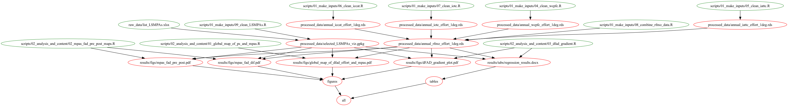

# Data and code for a subset of analysis related to "Global impacts of drifting Fish Aggregating Devices on marine protected areas"

## Info:
This repository is equipped with a `MAKEFILE`. All contents can be reproduced
by typing `make all` in your terminal. A flow diagram shows the dependencies
between input data, scripts, and output data / results.

