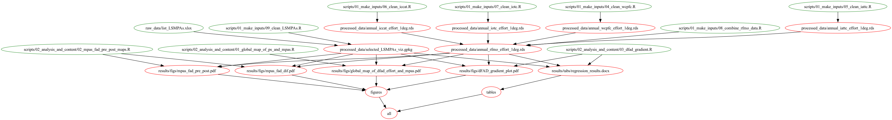

# Data and code for a subset of analysis related to "Global impacts of drifting Fish Aggregating Devices on marine protected areas"

Run everything with `make all` in the terminal.

## Reproducible environment

The repo uses [`renv`](https://rstudio.github.io/renv/) (R 4.5, aarch64 macOS). To restore the exact package library:

```r
install.packages("renv")   # if not already installed
renv::restore()
```

This reads `renv.lock` and installs all packages at the recorded versions.

## Structure

```
raw_data/          RFMO catch-effort data (WCPFC, IATTC, ICCAT, IOTC) + list_LSMPAs.xlsx
processed_data/    Cleaned/combined RDS and geopackage files
scripts/
  01_make_inputs/             Clean RFMO data, build GFW inputs, compile LSMPAs
  02_analysis_and_content/    Figures, tables, and regression models
results/
  figs/            Output figures (PDF)
  tabs/            Output tables (DOCX)
```



## Scripts (`02_analysis_and_content/`)

| Script | Output |
|--------|--------|
| `01_global_map_of_ps_and_mpas.R` | Global map of dFAD effort and MPAs |
| `02_mpas_fad_pre_post_maps.R` | Per-MPA pre/post maps + difference maps |
| `03_dfad_gradient_100_200.R` | Robustness checks (0–100–200 nm rings, pixel-level) |
| `04_dfad_gradient.R` | Main gradient analysis + main regression table |
| `05_time_series.R` | dFAD effort time series |

## Key processed data files

| File | Description |
|------|-------------|
| `annual_rfmo_effort_1deg.rds` | Combined RFMO dFAD effort at 1° resolution |
| `selected_LSMPAs_viz.gpkg` | LSMPA boundaries |
| `annual_pre_post_activity_by_select_mpa.rds` | Pre/post effort by MPA (output of `02`, input to `03`) |
